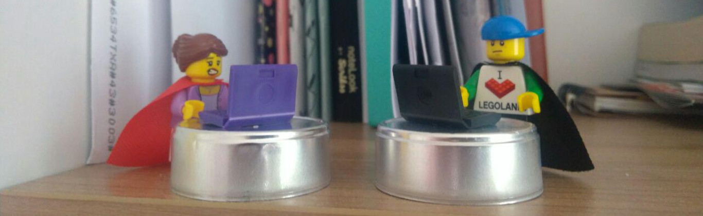

<link rel="stylesheet" href="css/hbk.css" type="text/css">

<body>

  <h1>Happy Birthday Hammermann!</h1>
  
This page is dedicated to celebrate your birthday via my recently acquired html and css skills. You will notice that there hasn't been much acquisition happened yet.

  

  <h3>A terribly animated celebratory message for you.</h3>
  

  
I know I know, it is not as impressive as my previous pygame gift. And I wasn't expressive about it much lately, but remember that you've always got someone out there who does miss your comradeship.

  <h3>Take care and have a great day!</h3>
  

</body>