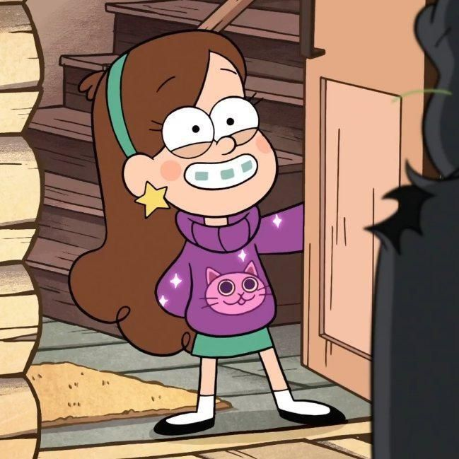

  

  
  

  

  
 <b>Hande Sodacı</b>

  
 PhD Student in Psychology 
      College of Social Sciences and Humanities 
      Koç University, Istanbul 
      <a href="mailto:hsodaci20[at]ku.edu.tr">hsodaci20[at]ku.edu.tr</a>

  
 Project Coordinator in the project <a href="https://bilisselakademilab.com/kule/" target="_blank">KULE</a> 
      MEF University, Istanbul

  
 Member of <a href="https://dililetisimlab.ku.edu.tr/en/members/" target="_blank">Language and Communication Development Lab</a> 
      Koç University, Istanbul

  

